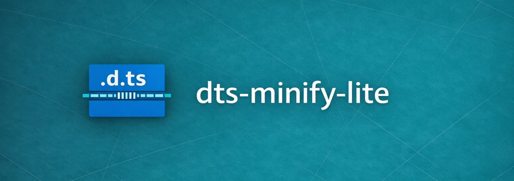

# Monorepo for [dts-minify-lite](https://npmx.dev/package/dts-minify-lite)

This monorepo contains the source code and related files for the [dts-minify-lite](https://npmx.dev/package/dts-minify-lite) library, a tool designed to minify TypeScript declaration files (.d.ts).

### Why?

This library focuses on providing a simple and efficient solution for developers looking to optimize their TypeScript declaration files (.d.ts).

## 📦 Packages

- [`dts-minify-lite`](./packages/dts-minify-lite): The core library that provides the functionality to minify TypeScript declaration files (.d.ts). It is designed to be lightweight, simple and with zero dependencies.

## 🤝 Contributing

Contributions to this monorepo are welcome! If you have any ideas for improvements or new features, please feel free to open an issue or submit a pull request. I appreciate your help in making [`dts-minify-lite`](https://npmx.dev/package/dts-minify-lite) better for everyone.

## 📄 License

This project is licensed under the MIT License. See the [LICENSE](LICENSE) file for details.
